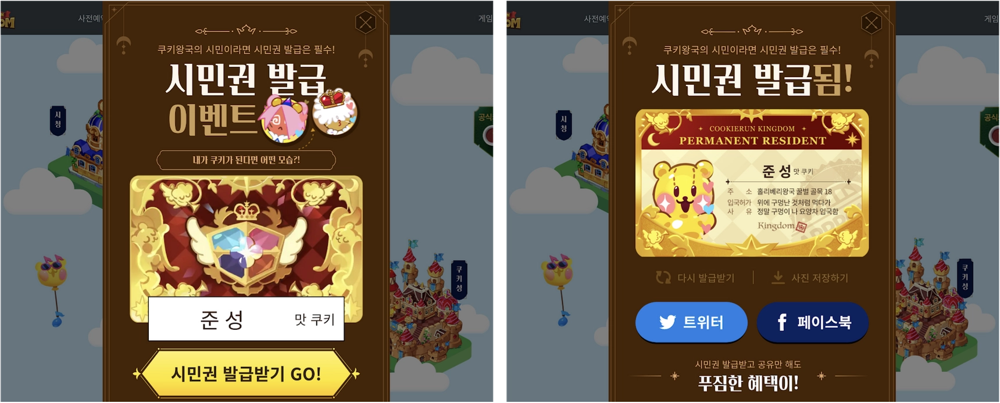

> 본 이력서는 [이 링크](https://www.notion.so/Junsung-Yoon-fb07f70750b447818af8236ddfc8cfb9)에서 더 잘 읽힙니다.

# 윤준성 | Junsung Yoon

Node.js 기반의 **백엔드 개발**에 능숙하며 프론트, DevOps 업무 경험이 있습니다.

데브시스터즈에서 2년 이상 근무하며 다양하고 새로운 프로젝트들을 킥오프하고 리드해본 경험이 있습니다.

현재 **현역 IT 산업기능요원**으로 복무중입니다.

근거에 기반한 커뮤니케이션과 동료와의 유대관계를 중요시합니다.

---

☎️ | +82 10-6641-1621

✉️ | yoonjs0510@kaist.ac.kr

💻 | [https://github.com/junbyeol](https://github.com/junbyeol)

📚 | [https://junbyeol.github.io](https://junbyeol.github.io)

Last Updated: `2023.02.06`

---

# SKILLS

⭐️⭐️ Production에 당장 능숙하게 사용가능한 기술
⭐️ Production에 활용할 수 있거나, 한 적 있는 기술

### Backend

- Node.js ⭐️⭐️
- Typescript ⭐️⭐️
- Fastify ⭐️⭐️
- Java ⭐️
- Kotlin ⭐️
- Spring Framework ⭐️

### Database

- MySQL ⭐️⭐️
- Redis ⭐️

### Web/HTTP

- React ⭐️⭐️
- GraphQL ⭐️⭐️
- websocket ⭐️⭐️

### DevOps

- Docker ⭐️⭐️
- Terraform ⭐️
- kubernetes ⭐️
- AWS
    - s3, ecr, rds, medialive 등 다수

---

# EXPERIENCES

## 2020.07
~현재

`1년 10개월 이상`

## 데브시스터즈

웹서비스셀 백엔드 개발자

`NodeJS` `Typescript` `GraphQL` `MySQL` `Docker` `AWS` `Terraform` `k8s` `websocket` `Redis`

- 쿠키런 IP를 활용한 게임회사
- 팀 전체 4~10명, 개발인원 3~5명
- 게임 소개/이벤트 진행용 사이트들의 GraphQL 서버 로직 구현 및 배포
- 전사 회의용 스트리밍 및 슈퍼챗 서버 구현 및 배포
- Document성 사이트들의 CMS 구축 및 배포 자동화
- 채용 설명회 참여, 기술블로그 글 작성, 사내 세미나 발표 경험 등

---

## 2020.01
~2020.06

`6개월`

## 셀렉트스타

개발팀 백엔드 개발자/백오피스 개발자

`Kotlin` `Spring Framework` `MySQL` `React` `Nginx` `Jenkins`

- 크라우드소싱 플랫폼 개발 스타트업
- 회사 전체 20~40명, 개발인원 5~6명
- 크라우드소싱 플랫폼 캐시미션의 RESTful 서버 로직 구현
- 캐시미션 어드민 사이트의 프론트/백엔드 구현
- 근태관리용 Slack 챗봇 개발

---

# PROJECTS

## 2021.10
~ 현재

`데브시스터즈`

## 사내 스트리밍 및 슈퍼챗 서버

- 전사 회의 시에 사용하는 스트리밍 시스템, **데브라이브**를 개발
    - 스튜디오에서 OBS(Open Broadcast Software)를 이용,  AWS Medialive로 HLS 스트림 생성 후, 뷰어 페이지에서 시청할 수 있도록 세팅
    - 슬랙을 통해 질문 수집, 수집된 질문은 유튜브 슈퍼챗 처럼, 스트리밍 되는 화면 위에 노출됨
    - 이 사항들(스트림 생성, 질문 관리)을 방송 스탭들이 쉽게 관리할 수 있도록 어드민 페이지 제작

`NodeJS` `Typescript` `websocket` `MySQL` `Docker` `Terraform` `k8s` `AWS` `Redis`

- 키워드: `websocket`, `Redis`, `AWS`
- 기여 범위: 서버 전체 및 인프라 유지보수, 리드 포지션으로 실시간 모니터링 주도

## 2021.02
~ 현재

`데브시스터즈`

## 웹서비스셀 CMS(Content Management System)

`NodeJS` `Javascript` `GraphQL` `MySQL` `Docker` `AWS` `Terraform` `k8s` `react`

- [공식사이트](http://www.devsisters.com), [게임사이트](https://game.devsisters.com/ko/cookierun/) 등 수동으로 관리되던 컨텐츠들의 관리와 배포를 **자동화**
- 높은 커스텀 자유도를 가진 오픈소스 Headless CMS **Strapi**를 이용, 다양한 기능들을 추가함
    - 유튜브에 업로드 되는 컨텐츠들을 cronjob으로 매번 업데이트
    - 사용자들이 쉽게 **원하는 환경**(preview, production)에서 컨텐츠들을 배포할 수 있게끔 개발(서버, 프론트 모두 개발)
- 키워드: `Headless CMS`, `react`
- 기여 범위: 서버 및 어드민 페이지 프론트 전체

## 2021.04
~ 2021.05

`데브시스터즈`

## 쿠키런:킹덤 10억감사제 당첨자 조회 서버

- 사은품 추첨 결과 조회 및 당첨자의 정보 수집용 사이트의 서버
- 당첨자 정보 수집 후 유관 부서에 제공

`NodeJS` `Typescript` `GraphQL` `MySQL` `Docker` `AWS` `Terraform` `k8s`

- 키워드: `GraphQL`, `커뮤니케이션`
- 기여 범위: 서버 전체 및 수집 데이터 관련 커뮤니케이션/전달

쿠키런:킹덤 10억감사제 당첨자 조회 사이트의 모습

## 2020.07
~2021.06

`데브시스터즈`

## 신규게임 사전예약 및 이벤트 서버

- 신규게임들(쿠키런: 킹덤, [브릭시티](https://www.playbrixity.com/ko/))의 **사전예약**을 받고, 관련 이벤트 등을 진행하기 위한 서버
    - 사전예약자들의 이메일, 전화번호 등 개인정보를 global하게 수집
    - 사전예약자들에게 **node-canvas로 생성**된 시민권 이미지를 발급하는 이벤트 등이 있었고, 관련 **프로파일링** 경험을 [기술블로그](https://tech.devsisters.com/posts/perf-citizen-card/)에 공유
    - sendinblue(메일링 관리 솔루션)과 사전예약자 DB 연동, AWS SES 활용 메일링 등의 메일링 관련 작업도 진행

`NodeJS` `Typescript` `GraphQL` `MySQL` `Docker` `AWS` `Terraform` `k8s`

- 키워드: `node-canvas`, `GraphQL`, `profiling`
- 기여도: 시민권 이미지 생성 서버 전체 및 사전예약 서버 일부

쿠키런:킹덤 사전예약 사이트 중 시민권 발급 이벤트의 모습

## 2020.03
~2020.06

`셀렉트스타`

## 근태관리용 Slack 챗봇 ‘너굴’

- 슬랙 명령어를 통해, 사원들의 출퇴근 및 월간 근무시간 관리 등을 담당하는 챗봇을 개발

`Spring Framework` `Kotlin` `Jenkins`

- 키워드: `REST api`, `Spring Framework`, `Kotlin`, `Slack API`
- 기여 범위: 서버 전체

](images/image-4.png)

당시 개발한 슬랙 챗봇 ‘너굴’의 후신 ‘덕비스’, 본 이미지의 대사와 기능은 ‘너굴’과 동일
출처) [셀렉트스타 블로그](https://blog.selectstar.ai/ko/welfare)

## 2020.03
~2020.08

`개인`

## KAIST 총학생회 사이트

- [KAIST 총학생회 사이트](https://student.kaist.ac.kr/web/main)의 초기 서버와 프론트 개발 (2인)

`NodeJS` `Koa` `Sequelize` `MySQL` `Nginx` `React`

- 키워드: `NodeJS` `React`
- 기여도: 서버와 프론트 각각 일부분

---

# EDUCATION

### 2018.03
~ 2019.12

### KAIST

- 전산학부 4학기 재학(현 휴학)
- 웹 개발 동아리 SPARCS 활동(2학기)
- [카이스트 총학생회 웹페이지](https://student.kaist.ac.kr/) 개발

### 2015.03
~ 2018.02

### 경기과학고등학교

- 정보올림피아드 동상(경기도 지역) 수상

---

# ACTIVITES

### 2021.02 데브시스터즈 기술블로그 글 기고

[사전예약 서버 프로파일링으로 서버 병목찾아 개선하기](https://tech.devsisters.com/posts/perf-citizen-card/)

### 2021.12 데브시스터즈-KAIST 전산학부 기업체 탐방 행사, 패널 참여

- “데브시스터즈 입사꿀팁" 실시간 발표, Q&A 진행(3명, 30분)
- “신입개발자"를 테마로 재학생 20~30여명과 실시간 Q&A 진행(2명, 60분)

### 2022.02 사내 서버개발자 모임 “월간 서버"에서 발표

제목: 데브라이브 인프라 개발기