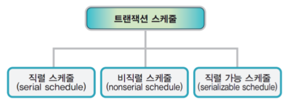
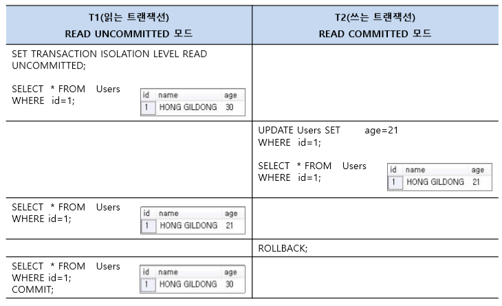
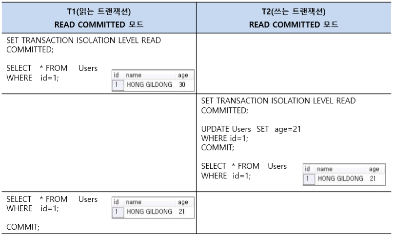
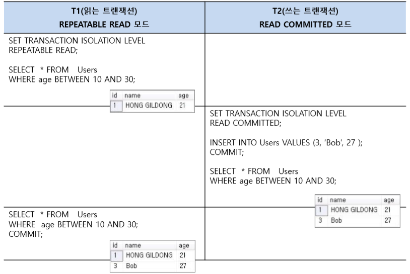
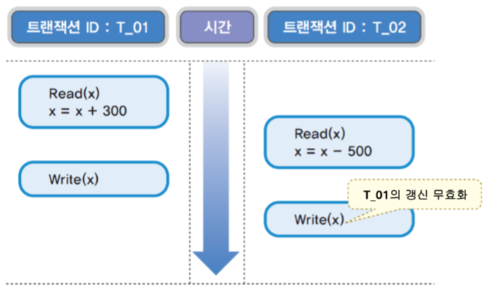
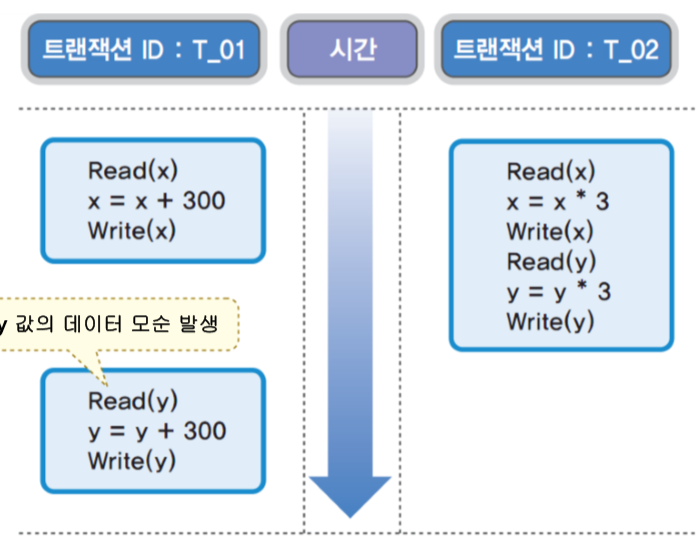
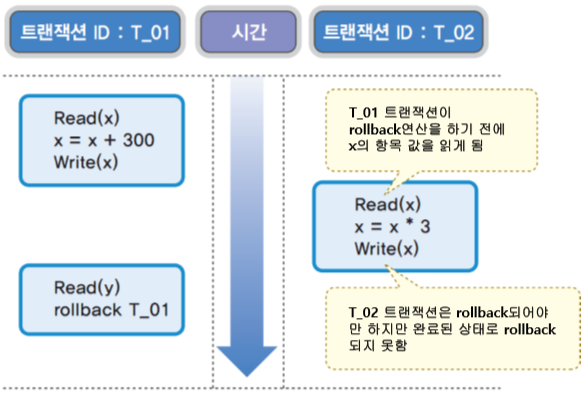
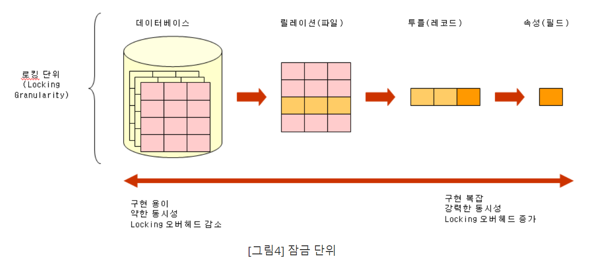
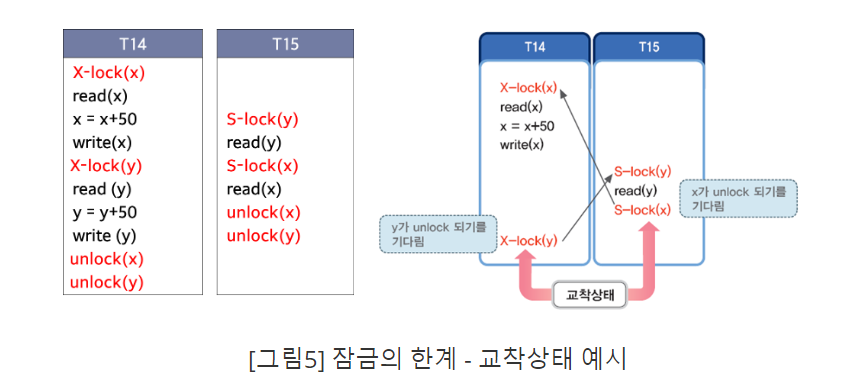

> 이 글은 윤준성의 개발꼬맹이 시절, 혼자 노션에 공부하며 정리해둔 것 중 괜찮은 것을 추려올린 글입니다.
> 기술블로그 글 기고 목적으로 작성되지 않아, 가독성이 좋지 않거나 알 수 없는 워딩이 있을 수 있습니다.

# 트랜잭션 스케쥴

- 직렬 스케쥴 : 하나의 트랜잭션이 끝나야 다음 트랜잭션을 실행할 수 있는 스케쥴
- 비직렬 스케쥴: 트랜잭션의 실행 순서와 무관, 병행 수행

- 직렬가능 스케쥴: 서로 영향을 주지 않는 직렬 스케쥴을 비직렬적으로 수행하겠다!
    
    → 동시성을 최대한 보장하면서도 직렬 스케쥴과 같은 결과를 얻을 수 있는 직렬 가능 스케쥴을 지향해야 함
    
    → 같은 데이터에 동시에 두 트랜잭션이 접근하는 경우의 수
    

# 비직렬적 스케쥴에서 발생할 수 있는 현상

## T1이 읽고, T2가 쓸때

### 오손 읽기(Dirty Read)

- T2가 값을 고치고
- T1이 그 값을 읽었는데
- T2가 롤백하면

→ T1은 무효가 된 데이터를 읽게 됨

### 반복 불가능 읽기(Non-repeatable Read)

- T2가 값을 고치고
- T1이 값을 읽었는데, 이전에 읽은 값과 값이 달라지는 현상

### 유령데이터 읽기(Phantom Read)

- T2가 새로운 값을 삽입하여
- T1이 이전에 없던 새로운 값을 읽게 되는 현상

## T1과 T2가 값을 쓸때

### 갱신 손실(Lost Update)

:T1의 갱신한 값을 T2가 덮어써서 T1의 갱신이 손실됨

### 모순성(Inconsistency)

:T1이 x, y를 각각 갱신하는 사이에 T2가 값을 갱신하여, 어떤 값은 갱신 전의 값을, 다른 값은 갱신 후의 값을 읽어 데이터가 불일치 하는 현상

### 연쇄 복귀(Cascading Rollback)

:T1이 x를 수정하고, 이를 롤백하려 하는데, 그 사이에 T2가 x를 또 다시 갱신해버려 T1의 롤백이 불가능한 상태

# 락(Lock)

:Optimistic Lock(비선점 락? 낙관적 락?)과 Pessimistic Lock(선점 락? 비관적 락?)

## 락킹 단위(Locking Granularity)

:잠금의 대상이 되는 객체의 크기

## Optimistic Lock

:트랜잭션 대부분 충돌이 발생하지 않을 때 사용하는 방법

→ 자원을 선점하지 말자, 충돌이 일어날 때만 적절히 대응하자

→ 엔티티에 version을 담아두고, 수정할 때마다 version을 +1씩 업데이트 한다

→ 엔티티를 가져와서 값을 수정하고 다시 저장하려고 하는데 갖고 있는 version과 DB의 version이 다르면 rollback!

## Pessimistic Lock

:트랜잭션이 데이터에 접근하는 동안 그 데이터를 선점

다시 공유락(LS, Shared Lock)과 배타락(LX, Exclusive Lock)으로 나뉨

- 공유락) T1이 X에 대해 공유락을 걸면
    - T1과 T2 모두 X를 읽기만 할 수 있음
    - T2가 동시에 X에 대해 또 다시 공유락을 걸 수 있음
- 배타락) T1이 X에 대해 배타락을 걸면
    - T1은 X에 대해 읽기/쓰기를 모두 할 수 있지만
    - T2는 아무것도 할 수 없음
    - 락을 허용받지 못한 T2는 대기 상태가 된다
    

## 2단계 락킹(2PLP: 2-Phase Locking Protocol)

: 트랜잭션들이 Lock하는 시간과 Unlock하는 시간을 구분하여 수행

→ 직렬 가능한 스케쥴을 항상 보장한다는 것에 의의가 있다

- 확장단계(growing phase): 트랜잭션이 Lock 연산만 할 수 있고, Unlock은 할 수 없음
- 축소단계(shrinking phase): 트랜잭션이 Unlock 연산만 할 수 있고, Lock은 할 수 없음

→ 연쇄 복귀 문제에 빠질 수 있다

→ 이는 모든 unlock연산을 트랜잭션이 완전히 완료된 후에 실행하도록 하는 엄격한 2단계 잠금(strict 2-Phase Locking Protocol)을 통해 해결 가능하다

# 교착상태(Deadlock)

→ 두 트랜잭션의 서로의 Unlock연산만 기다리고 대기상태에 들어가게 됨