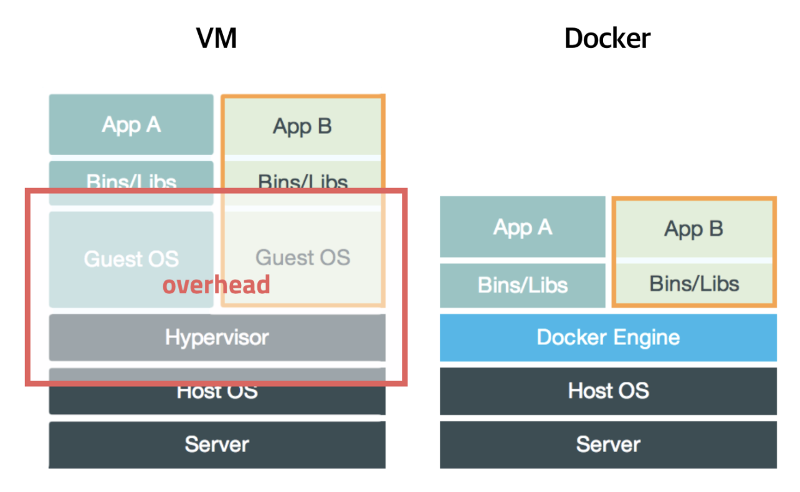

> 이 글은 윤준성의 개발꼬맹이 시절, 혼자 노션에 공부하며 정리해둔 것 중 괜찮은 것을 추려올린 글입니다.
> 기술블로그 글 기고 목적으로 작성되지 않아, 가독성이 좋지 않거나 알 수 없는 워딩이 있을 수 있습니다.


: 컨테이너 기반의 오픈소스 가상화 플랫폼

[초보를 위한 도커 안내서 - 도커란 무엇인가?](https://subicura.com/2017/01/19/docker-guide-for-beginners-1.html#%EC%A0%95%EB%A6%AC)

### 가상화

: Hypervisor를 이용, 하나의 물리적 머신에 다수의 가상 머신을 만드는 기술

# 컨테이너

: 가상화 기술의 하나로써, 격리된 공간에서 프로세스가 동작하는 기술

### 탄생 배경



- VMware, VirtualBox
    - OS를 가상화
    - 호스트 OS 위에 게스트 OS를 구동시킴
    - 간단하지만 오버헤드 심함
- KVM(Kernel-based Virtual Machine)
    - CPU를 가상화
- Xen
    - 반가상화(Paravirtualization)

→ 하지만 근본적으로 모두 추가적인 OS 설치가 필요! 성능문제 여전

**→ 프로세스를 격리하자!**

# 이미지(image)

: 컨테이너 실행에 필요한 파일과 설정값 등을 포함하고 있는 밑그림

- 컨테이너를 실행하기 위한 모오오오오든 것을 가지고 있어 의존성 관리가 매우 편리하다!

### DockerFile 작성하기

- Dockerfile은 image를 생성하기 위한 일련의 instruction 집합!
- GitHub에 Dockerfile을 올려두면
    
    → 다른 개발자들은 그걸 받아 이미지로 뜨고
    
    → 컨테이너를 만들기만 하면 모든 개발자가 같은 세팅에서 작업 가능!
    

```docker
#baseImage는 가벼울수록 좋다!
#ubuntu를 사용하면 유사시에 컨테이너에 직접 접근해서 컨트롤하기가 용이
#무거운 ubuntu대신 alpine 등 경량화된 이미지용 OS(?)도 있다.

FROM ubuntu:xenial-20191024 
LABEL maintainer="web@devsisters.com"

RUN apt-get -yqq update
RUN apt-get install -y --no-install-recommends curl ca-certificates build-essential

#nodejs의 버전관리
RUN curl -SL https://deb.nodesource.com/setup_12.x | bash - &&\
  apt-get -yqq update &&\
  apt-get install -y nodejs &&\
  rm -rf /var/lib/apt/lists/*
# 마지막 과정은 apt-get이 만드는 메타데이터들을 삭제하여 이미지의 크기를 줄인다

COPY package*.json ./
RUN npm install --production --silent

COPY . .
#위의 package*.json 을 COPY하는 과정은 이 과정에서도 한번 더 일어나는데?
#cache에 관한 문제를 해결하기 위함 

CMD npm start
EXPOSE 8000
```

[[docker] 헷갈리는 Dockerfile 명령어 · Issue #90 · heowc/programming-study](https://github.com/heowc/programming-study/issues/90)