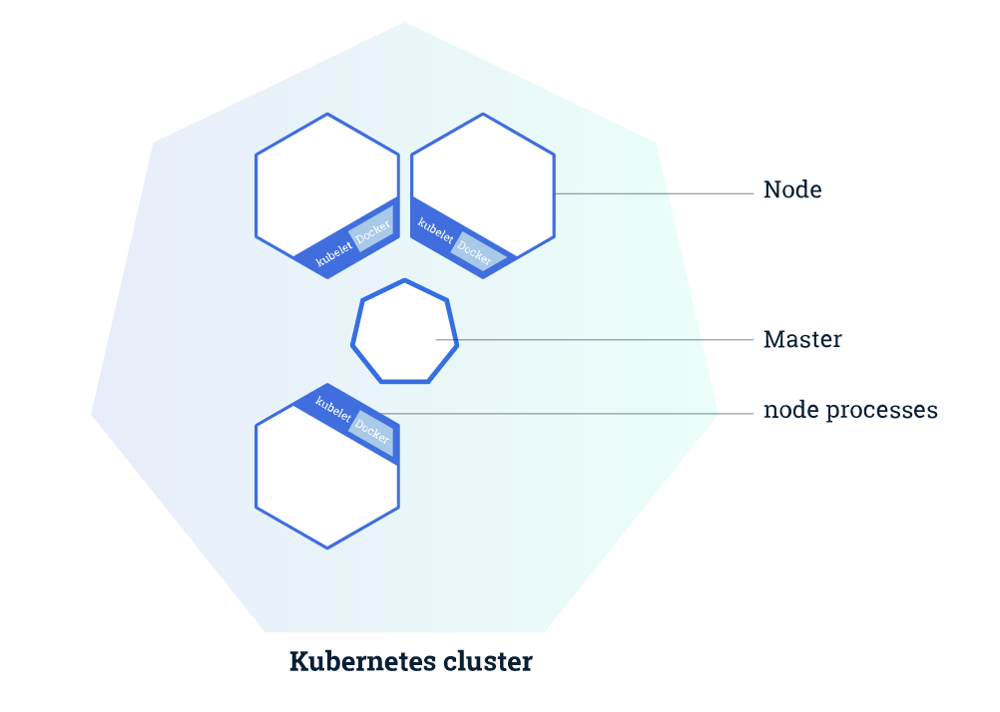

> 이 글은 윤준성의 개발꼬맹이 시절, 혼자 노션에 공부하며 정리해둔 것 중 괜찮은 것을 추려올린 글입니다.
> 기술블로그 글 기고 목적으로 작성되지 않아, 가독성이 좋지 않거나 알 수 없는 워딩이 있을 수 있습니다.


: 컨테이너 오케스트레이션 툴

- 툴마다 다르지만 컨테이너의 배포나 관리를 도와주는 녀석!
- 스케쥴링
    - 적당한 서버에 배포
- 클러스터링
    - 여러 개의 서버를 하나의 서버처럼 사용
- 서비스 디스커버리
    - key value에 저장할 필요 없이 바로 가져올 수 있음
- 로깅, 모니터링으로 중앙에서 관리 가능
- 비슷한 툴로는 Docker Swarm, Apache Mesos 가 있다

# 쿠버네티스 오브젝트

[쿠버네티스 시작하기 - Kubernetes란 무엇인가?](https://subicura.com/2019/05/19/kubernetes-basic-1.html#%EC%BF%A0%EB%B2%84%EB%84%A4%ED%8B%B0%EC%8A%A4-%EA%B8%B0%EB%B3%B8-%EA%B0%9C%EB%85%90)

### Pod

- 쿠버네티스에 배포 가능한 가장 작은 단위
- 한 개 이상의 컨테이너와 스토리지, 네트워크 속성으로 구성
    - pod내의 컨테이너들은 스토리지를 공유한다!
    - pod내의 컨테이너들은 서로 localhost로 접근할 수 있다!
- 컨테이너를 하나만 사용하더라도 Pod로 반드시 감싸야함


# 쿠버네티스 아키텍쳐


# 튜토리얼 정리

[튜토리얼](https://kubernetes.io/ko/docs/tutorials/)

### 1. 쿠버네티스 클러스터 생성하기

- 클러스터는 마스터 + 노드
    - 마스터
        - 클러스터를 관리, 컨트롤
    - 노드
        - 애플리케이션 구동한다
        - Kubelet은 마스터와 통신하고 노드를 관리한다
        - 컨테이너 운영을 담당하는 Docker나 rkt같은 툴을 갖는다



```bash
#클러스터 정보 보기
kubectl cluster-info
#node들 정보 보기
kubectl get nodes
```

### 2. 앱 배포하기

- 쿠버네티스 Deployment 설정을 만들어야한다
    - 인스턴스를 어떻게 생성할지
    - 어떻게 업데이트할지
    - 이 정보를 통해, 마스터는 클러스터의 노드에서 앱이 배포되도록 스케쥴한다
- 쿠버네티스 Deployment 컨트롤러는 노드가 다운/삭제 되었을때 노드를 교체해주는 self-healing도 제공한다!

```bash
#deployment 생성
#kubectl create deployment
kubectl create deployment kubernetes-bootcamp --image=gcr.io/googkle-samples/kubernetes-booycamp:v1

#deploymeny 확인
kubectl get deployments

#proxy 시작
#curl http://localhost:8001/version(예시)로 확인해보자!
kubectl proxy
```

### 3. 파드와 노드 보기

```bash
# pods 정보보기
kubectl get pods

# pods에 속한 container들 등 보기
kubectl describe pods

#$POD_NAME의 컨테이너 접속해서 명령실행하기
kubectl exec -it $POD_NAME bash
```

### 4. 앱 외부로 노출하기

- service: 비슷한 기능을 하는 파드들의 모음!

```bash
# services 정보보기
kubectl get services

# 새로운 service 포트 할당하기
kubectl expose deploment/kubernetes-bootcamp --type="NodePort" --port 8080

# 열린 포트 번호 등 정보 보기
kubectl describe services
kubectl describe services/(서비스 이름)

# service로 필터링(run=kubernetes-bootcamp라는 라벨이 붙은 것)하기
kubectl get pods -l run=kubernetes-bootcamp
kubectl get services -l run=kubernetes-bootcamp

# (app=v1이라는)라벨링하기
kubectl label pod $POD_NAME app=v1

kubectl get pods -l app=v1

# 서비스 배포 중단하기
kubectl delete service -l run=kubernetes-bootcamp
# 외부에 공개되던 것이 중단될 뿐, 실제로 kubectl delete를 해도 pod에서 server는 계속 구동중이다
# curl $(ip):$NODE_PORT로 하면 접근이 거부되지만
# kubectl exec -it $POD_NAME curl localhost:8080으로는 server가 작동됨을 확인 가능
```

## k8s Secret

비밀번호, 토큰, 키 등을 secret에 저장하자!

파드가 시크릿을 참조하는 방법은 3가지가 있다

- 하나 이상의 컨테이너에 마운트된 볼륨 내의 파일로써 사용
- 컨테이너의 환경변수로써 사용
- 파드의 이미지를 가져올 때 kubelet에 의해 사용

## 시크릿 생성하기

### kubectl 이용

```bash
# 각각 username, password 이라는 키명으로 username.txt, password.txt.에서 값 가져오기
kubectl create secret generic db-user-pass --from-file=username=./username.txt --from-file=password=./password.txt

# 생성된 시크릿 확인
kubectl get secrets
kubectl describe secrets/db-user-pass
```

### yaml로 직접 작성

```bash
echo -n 'admin' | base64
# YWRtaW4=

echo -n '1f2d1e2e67df' | base64
# MWYyZDFlMmU2N2Rm
```

일 때 시크릿을 아래와 같이 작성하고

```bash
apiVersion: v1
kind: Secret
metadata:
  name: mysecret
type: Opaque
data:
  username: YWRtaW4=
  password: MWYyZDFlMmU2N2Rm
```

`kubectl apply -f ./secret.yaml` 로 시크릿을 생성할 수 있다. 하지만, 이 방법은 base64로 인코딩 하는 과정을 거치는 방법이다. base64로 인코딩되지 않은 문자열을 시크릿에 직접 넣을 수도 있다. 애플리케이션이 다음 구성 파일을 사용할 때,

```bash
apiUrl: "https://my.api.com/api/v1"
username: "user"
password: "password"
```