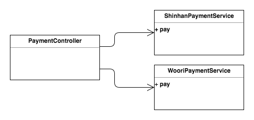
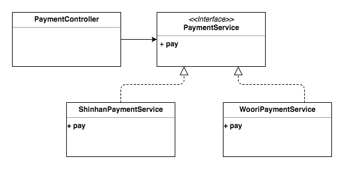
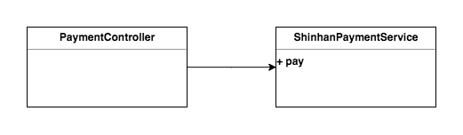
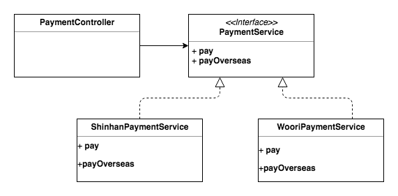
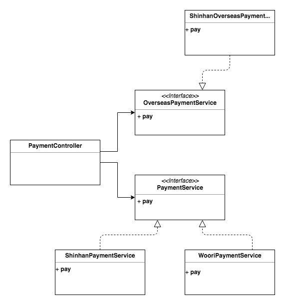

> 이 글은 윤준성의 개발꼬맹이 시절, 혼자 노션에 공부하며 정리해둔 것 중 괜찮은 것을 추려올린 글입니다.
> 기술블로그 글 기고 목적으로 작성되지 않아, 가독성이 좋지 않거나 알 수 없는 워딩이 있을 수 있습니다.

SOLID: 객체지향설계 5대 원칙

[Spring 예제로 보는 SOLID DIP - Yun Blog | 기술 블로그](https://cheese10yun.github.io/spring-solid-dip/)

# OCP

: Open/Closed Principle, 개방-폐쇄 원칙

: 확장에 대해서는 개방 되어 있어야 하지만, 변경에 대해서는 폐쇄되어야 한다

- 확장? → 새로운 타입을 추가함으로써 새로운 기능을 구현한다
- 변경? → 확장이 발생했을 때, 해당 코드를 호출하는 쪽에서 변경이 발생하지 않아야 변경에 대해 닫혀있는 것

### OCP 실패 사례



- 신한카드 결제만 있었던 시스템에, 우리은행 결제가 추가되어야 한다!

```java
@RequestMapping(value = "/ocp/anti/payment/shinhan", method = RequestMethod.POST)
public void pay(@RequestBody ShinhanCardDto.PaymentRequest req){
    shinhanCardPaymentService.pay(req);
}

@RequestMapping(value = "/ocp/anti/payment/woori", method = RequestMethod.POST)
public void pay(@RequestBody WooriCardDto.PaymentRequest req){
    wooriCardPaymentService.pay(req);
}
```

⇒ 앞으로 카드가 추가될 때마다, 새로운 API를 계속 만들어야함

```java
public static class PaymentRequest {
    private String cardNumber;
    private String csv;
    private CardType type;
}
// 컨트롤러
@RequestMapping(value = "/ocp/anti/payment", method = RequestMethod.POST)
public void pay(@RequestBody CardPaymentDto.PaymentRequest req){
    if(req.getType() == CardType.SHINHAN){
        shinhanCardPaymentService.pay(req);
    }else if(req.getType() == CardType.WOORI){
        wooriCardPaymentService.pay(req);
    }
    // 그 해당 카드 이외의 타입이 들어오면 예외처리는 어떻게??...
}
```

⇒ API 면에서 보았을 때, DIP의 개념 준수

⇒ Request값을 통일하여 추상화의 기초가 됨

⇒ 카드가 추가될 때마다 if문이 추가되어야 함 == 컨트롤러 계층이 너무 많은 책임을 갖는것

⇒ 확장이 발생했을 때, 해당 코드를 호출하는 쪽에서 코드의 변경이 일어나므로 OCP 실패

### OCP 성공



```java
public class PaymentController {
    @RequestMapping(value = "/payment", method = RequestMethod.POST)
    public void pay(@RequestBody CardPaymentDto.PaymentRequest req) {
        final CardPaymentService cardPaymentService = cardPaymentFactory.getType(req.getType());
        cardPaymentService.pay(req);
    }
}
public class ShinhanCardPaymentService implements CardPaymentService {
    @Override
    public void pay(CardPaymentDto.PaymentRequest req) {
        final ShinhanCardDto.PaymentRequest paymentRequest = buildPayment(req);
        shinhanCardApi.pay(paymentRequest);
    }
}
public class WooriCardPaymentService implements CardPaymentService {    
    @Override
    public void pay(CardPaymentDto.PaymentRequest req) {
        final WooriCardDto.PaymentRequest paymentRequest = buildPayment(req);
        wooriCardApi.pay(paymentRequest);
    }
}
```

⇒ 새로운 카드 결제가 추가되어도 Controller의 수정이 필요없음(cardPaymentFactory 클래스의 수정이 일어나기는 함)

# DIP

: Dependency Inversion Principle, 의존관계 역전 원칙

- 상위 모듈이 하위 모듈에 의존해서는 안된다

### DIP 실패사례



- 상위모듈(PaymentController)이 하위모듈(ShinhanPaymentService)에 의존하고 있다

```java
class PaymentController {
    @RequestMapping(value = "/dip/anti/payment", method = RequestMethod.POST)
    public void pay(@RequestBody ShinhanCardDto.PaymentRequest req){
        shinhanCardPaymentService.pay(req);
    }   
}
class ShinhanCardPaymentService {
    public void pay(ShinhanCardDto.PaymentRequest req) {
        shinhanCardApi.pay(req);
    }   
}
```

⇒ RequestBody의 키값 하나만 바뀌어도, 컨트롤러, 서비스, 심지어 프론트엔드까지 영향을 미침

⇒ 확장에 유연하지 못함(OCP 실패)

### DIP 성공


```java
class PaymentController {
    @RequestMapping(value = "/payment", method = RequestMethod.POST)
    public void pay(@RequestBody CardPaymentDto.PaymentRequest req) {
        final CardPaymentService cardPaymentService = cardPaymentFactory.getType(req.getType());
        cardPaymentService.pay(req);
    }
}

public interface CardPaymentService {
    void pay(CardPaymentDto.PaymentRequest req);
}

public class ShinhanCardPaymentService implements CardPaymentService {
    @Override
    public void pay(CardPaymentDto.PaymentRequest req) {
        shinhanCardApi.pay(req);
    }
}
```

⇒ 상위모듈(PaymentController)이 PaymentService 인터페이스를 바라보며 하위모듈(ShinhanCardPaymentService)에 의존하지 않음

# SRP

: Single Responsibility Principle, 단일 책임 원칙

: 클래스나 메소드는 하나의 역할만을 하며, 한가지 책임만을 진다

- 클래스는 단 한개의 책임을 가져야 한다
- 누가 해당 메소드의 변경을 유발하는 사용자(Actor)인가?

### SRP 실패 사례

- 신한카드에 해외결제 기능을 추가하고, 우리은행은 해외 결제가 되지 않는다면?



```java
public interface CardPaymentService {
    void pay(CardPaymentDto.PaymentRequest req);
    void payOverseas(CardPaymentDto.PaymentRequest req);
}

public class ShinhanCardPaymentService implements CardPaymentService {
    @Override
    public void payOverseas(CardPaymentDto.PaymentRequest req) {
        // .. 신한 카드 해외 결제 로직..
        shinhanCardApi.pay(paymentRequest);
    }
}

public class WooriCardPaymentService implements CardPaymentService {
    @Override
    public void payOverseas(CardPaymentDto.PaymentRequest req) {
        // 우리 카드 결제는 해외 결제 기능이 없음...
    }
}
```

⇒ 하나의 클래스에 해외결제/국내결제를 하고자 하는 두 명의 Actor가 존재 == 두 개의 책임이 존재

⇒ 만일 모든 클래스가 모두 해외결제/국내결제를 지원한다면, 그것은 카드결제를 하는 큰 한 명의 Actor만이 있다라고 볼 수 있다 == 큰 하나의 책임으로 묶을 수 있음

### SRP 성공



⇒ 

# ISP

: Interface Segregation Principle, 인터페이스 분리 원칙

: 클라이언트가 자신이 이용하지 않는 메소드에 의존하면 안된다

### ISP 실패 사례


- 우리은행은 payOverseas를 이용하지 않는데, paymentService에 의존하고 있다

```java
public interface CardPaymentService {
    void pay(CardPaymentDto.PaymentRequest req);
    void payOverseas(CardPaymentDto.PaymentRequest req);
}

public class ShinhanCardPaymentService implements CardPaymentService {
    @Override
    public void payOverseas(CardPaymentDto.PaymentRequest req) {
        // .. 신한 카드 해외 결제 로직..
        shinhanCardApi.pay(paymentRequest);
    }
}

public class WooriCardPaymentService implements CardPaymentService {
    @Override
    public void payOverseas(CardPaymentDto.PaymentRequest req) {
        // 우리 카드 결제는 해외 결제 기능이 없음...
    }
}
```

### ISP 성공


```java
public interface PaymentService {
  void pay(CardPaymentDto.PaymentRequest req);
}

public interface OverseasPaymentService {
	void payOverseas(CardPaymentDto.PaymentRequest req);
}

public class ShinhanCardPaymentService implements PaymentService, OverseasPaymentService {
    @Override
    public void payOverseas(CardPaymentDto.PaymentRequest req) {
        // .. 신한 카드 해외 결제 로직..
        shinhanCardApi.pay(paymentRequest);
    }
}

public class WooriCardPaymentService implements PaymentService {
    @Override
    public void payOverseas(CardPaymentDto.PaymentRequest req) {
        // 우리 카드 결제는 해외 결제 기능이 없음...
    }
}
```

# LSP

: Liskov Substitution principle, 리스코프 치환 원칙

: 자식 클래스는 언제나 자신의 부모 클래스를 교체할 수 있다

( 부모 클래스의 명세를 따라야 한다, 부모 클래스가 하는 일을 다 충실히 수행해야 한다 )

```java
public class Rectangle {
	int width;
	int height;

	public void setWidth(int width) {
		this.width = width;
	} 

	public void setHeight(int height) {
		this.height = height;
	}

	//getter
}

public class Square extends Rectangle {
	@Override
	public void setWidth(int width) {
		super.setWidth(width);
		super.setHeight(width);
	} 

	@Override
	public void setHeight(int height) {
		super.setWidth(width);
		super.setHeight(width);
	}

	//getter
}
```

```java
public void calculateAreaTest(Rectangle rectangle){
	rectangle.setWidth(2);
	rectangle.setHeight(3);

	assert r.getWidth() * r.getHeight() == 6 : printError()
}
```

⇒ rectangle에 Rectangle()과 Square()을 넣었을 때의 결과가 달라진다

⇒ Rectangle 객체에서 작동하는 것이 Square에서 작동하지 않으므로 LSP 위반