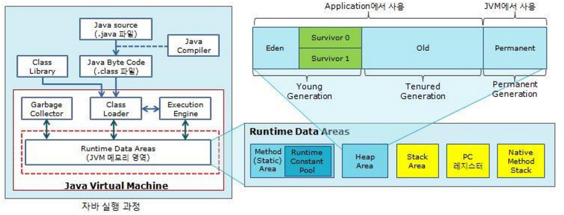
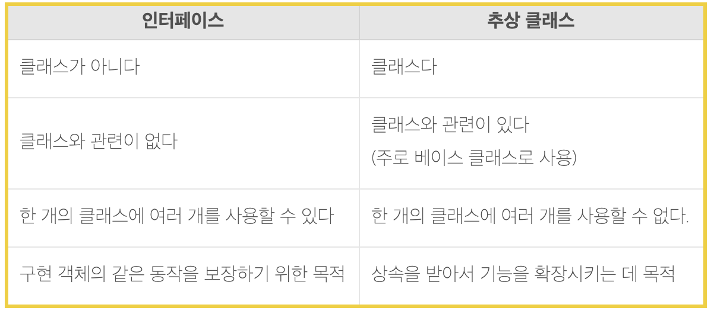

# 특징

1. 객체 지향적이다
2. 플랫폼 독립적이다
3. 보안성이 뛰어나다
4. Garbage Collector가 자동으로 메모리를 관리해준다
5. 멀티 쓰레드를 지원한다

# OOP(Object-Oriented Programming)

> 역할, 책임, 협력  -오브젝트

- Encapsulation, Inheritance, Polymorpism

  → 이 모든 것을 포함한 개념 = Class

### Encapsulation(캡슐화)

- 객체의 속성(field)와 행위(method)를 하나로 묶는 것 + 실제 구현 내용을 외부로부터 숨기는것(정보 은닉)
- 자바의 접근제어자
    - public: 어떤 클래스의 객체에서든 접근 가능
    - private: 이 클래스에서 생성된 객체들만 접근 가능
    - protected: 이 클래스와 동일패키지에 있거나 상속관계에 있는 하위 클래스의 객체들만 접근 가능

### Inheritance(상속)

- 객체들 간의 관계를 구축하는 방법
    - 쉽게 말해 자식클래스가 부모클래스의 기능을 물려받는 것!

### Polymorphism(다형성)

- 같은 모양의 코드가 여러 가지 형태/기능을 가질 수 있는 능력
- Overriding
    - 자식 클래스가 부모 클래스의 기능을 새롭게 정의하는 것
- Overloading
    - 하나의 클래스에서 같은 이름의 메소드들을 여러 개 만드는 것

# SOLID

//todo

# 자바 코드의 실행

- source code: 우리가 일반적으로 작성하는 코드
- byte code: 특정 프로그램(여기서는 JVM)이 이해하도록 변환된 코드
- VM: byte code를 로딩하고, 필요한 기능을 OS에게 호출하는 역할

cf) native code: 기계어 코드로, OS에 종속되는, 특정 OS에서만 실행할 수 있는 코드

ex) 윈도우의 메모장은 native app이므로, native code로 되어 곧장 OS의 기능을 호출하고, VM을 거칠 필요가 없다

## JVM

- Class Loader(클래스 로더): 일종의 Linker, 런타임시 클래스를 load함
- Execution Engine(실행 엔진): Class Loader를 통해 JVM 내부로 넘어와 JVM 메모리에 배치된 Byte code들을 명령어 단위로 실행
- GC : 참조되지 않거나 null인 객체의 메모리를 반환

# 타입

## 기본형 타입(primitive type)

- boolean, byte, short, int, long, float, double, char(8가지)
- Null이 존재하지 않는다
- 실제 값을 저장, stack 메모리에 저장된다

## 참조형 타입(reference type)

- 기본형 타입이 아닌 모든 타입
- Null이 존재한다
- 값이 저장되어 있는 주소값을 저장, heap 메모리에 저장된다

# 상속

:상위 클래스의 모든 멤버를 하위 클래스가 물려 받는것

상속하는 클래스 : Base, Super, Parent

상속받는 클래스 : Derivation, Sub, Child

최상위 클래스는 java.lang.Object

# 다형성

:여러가지 형태를 가질 수 있는 능력

- Overriding
    - 자식 클래스가 부모 클래스의 (추상) 메소드를 같은 이름, 같은 리턴, 같은 인자 내의 로직들 새롭게 정의하는 것
- Overloading
    - 하나의 클래스에서 같은 이름의 메소드들을 여러 개 갖게 하는 것

# 추상 클래스

:하위 클래스에서 구현될 기능을 추상 메소드로 선언

- abstract 예약어가 붙어 있어야함

# 인터페이스

:구현하는 모든 클래스에 대해 특정 메소드들을 반드시 포함하도록 한다

- public static final 변수와 public abstract만을 포함한다

# 출처
[인터페이스(interface)와 추상 클래스(abstract class)](https://loustler.io/languages/oop_interface_and_abstract_class/)
