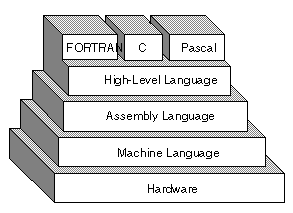
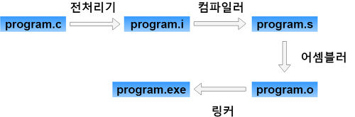
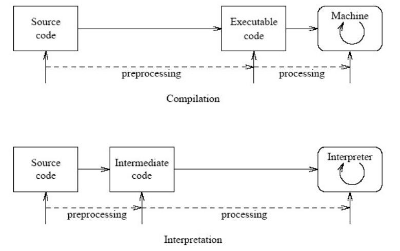
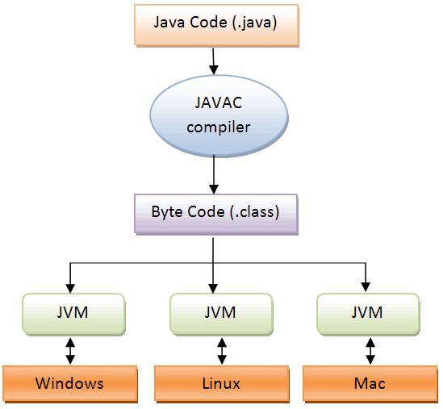
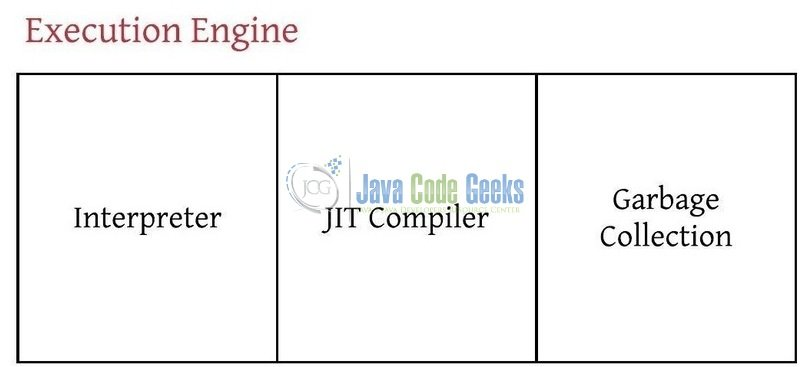

> 이 글은 윤준성의 개발꼬맹이 시절, 혼자 노션에 공부하며 정리해둔 것 중 괜찮은 것을 추려올린 글입니다.
> 기술블로그 글 기고 목적으로 작성되지 않아, 가독성이 좋지 않거나 알 수 없는 워딩이 있을 수 있습니다.

프로그램 실행: 프로그래밍 언어(High-level)를 런타임 이전에 기계어로 해석하는 과정

[실행 (컴퓨팅)](https://ko.wikipedia.org/wiki/%EC%8B%A4%ED%96%89_(%EC%BB%B4%ED%93%A8%ED%8C%85))

# C의 실행 과정(gcc)

1. 전처리 단계 - 전처리기(cpp)
    - #include, #define 등 #으로 시작하는 문법 사항이 적절히 전처리된 C 언어 소스파일 생성
2. 컴파일 단계 - 컴파일러(cc1)
    - 고급 언어 → 저급언어(어셈블리)
    - C 언어 소스파일 —컴파일—> 어셈블리 소스 파일
3. 어셈블 단계 - 어셈블러(as)
    - 어셈블리 소스 파일 —어셈블—>목적파일
4. 링크 단계 - 링커(id)
    - 목적파일들 + 라이브러리 —링크—> 실행 가능한 파일

# 용어

## 런타임

- 프로그램이 실행되고 있는 때에 존재하는 곳
- Javascript의 런타임인 Browser 혹은 Node.js

<aside>
💡 런타임 VS 컴파일타임

* 이름에서도 알 수 있듯이 '실행되는 때'와 '번역되는 때'로 다르다
* 컴파일타임 오류
  - Syntax error, Typecheck error
* 런타임 오류
  - 0나누기, Null참조, 스택오버플로우

</aside>

## 컴파일러 vs 인터프리터

- 컴파일러는 소스코드 전체를 훑고 실행가능한 파일로 변환한 후 실행하지만,
인터프리터는 각 행을 중간코드로 변환하고 차례로 실행한다
- 컴파일러가 인터프리터 보다 실행시간이 빠르다
- 컴파일러는 전체파일을 변환한 뒤 에러를 보고하지만,
인터프리터는 에러가 발생한 행에서 에러를 보고하고 그 이후 코드는 보지 않는다
- 컴파일러를 사용하는 언어: C
인터프리터를 사용하는 언어: Python

<aside>
💡 모든 언어를 엄밀하게 컴파일러/인터프리터 언어로 나눌 수는 없다
자바는 컴파일과 인터프리트를 병행하여 양단의 장점을 취하고, 심지어 자바스크립트는 해석 엔진에 따라 실행 과정이 제각각이다(추후 작성)

</aside>

## 빌드

- 소스코드 → 실행가능한 소프트웨어 산출물로 만드는 일련의 과정
- 컴파일은 빌드의 한 단계
- 대략, 컴파일 + 링크 = 빌드 라고 봐도 무방

# Java의 실행과정

1. java 파일은 javac(java compiler, gcc 자바 버전) 바이트코드로 쓰여진 .class 파일로 **컴파일**됨
    - 바이트코드는 JVM이 이해할 수 있는 자바 소스 코드
    - JVM만 있으면 어떤 OS에서도 실행가능하다
    - OS마다 맥용 JVM, 리눅스용 JVM이 있다는 뜻
        
        = JVM은 OS 종속적이지만, 자바는 OS에 비 종속적이다!
        

<aside>
💡 JVM(Java Virtual **Machine**)도 기계어를 읽는 **기계**다
기계어가 지칭하는 기계가 꼭 하드웨어일 필요는 없다.

</aside>

2. 자바의 런타임 과정에서 자바 바이트코드와 라이브러리는 JVM의 클래스 로더에 의해 묶인다(일종의 링커?)

3. 자바 인터프리터와 JIT Compiler로 자바 바이트코드를 명령어 단위로 읽어서 실행함

- 인터프리터의 속도가 느리다는 단점을 보완하기 위해 추후에 등장한 것이 JIT Compiler
- 이 둘의 적절한 협업으로 Execution Engine의 성능이 향상된다

4. JVM이 OS로부터 할당받은 메모리공간에서 자바가 실행된다!

