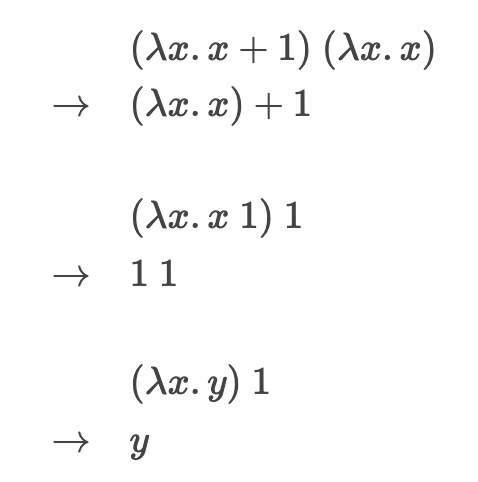

> 이 글은 윤준성의 개발꼬맹이 시절, 혼자 노션에 공부하며 정리해둔 것 중 괜찮은 것을 추려올린 글입니다.
> 기술블로그 글 기고 목적으로 작성되지 않아, 가독성이 좋지 않거나 알 수 없는 워딩이 있을 수 있습니다.

[타입 체계](https://hjaem.info/articles/kr_19_5)

## 타입 에러

- 에러에는 런타임에러와 컴파일에러 두 종류가 있다.



위에서부터 1, 2, 3 번 오류

- 이런 에러는 런타임에러라고 볼 수 있다.
    - 보통 프로그래머의 의도가 아닌, 실수이다.
- 타입 에러는 런타임 에러의 한 종류이다.
- 타입 에러를 정의하려면 타입부터 정의해야 한다.
- 타입은 값을 분류한 것이다.

```
1, 42, 0 , -1 : 정수
λx.x, λx.x 1 : 함수
```

- 타입 에러는 프로그램 실행 중 기대되는 타입과 실제 들어온 타입이 달라서 생긴 에러이다.
    - 위 실패한 에러들을 살펴보자.
    - 1번 오류
        - `+` 의 피연산자의 타입은 모두 정수여야 하는데 함수가 들어왔으므로 타입 에러다.
    - 2번 오류
        - λx.x 1 이 녀석은 첫 피연산자 자리에 함수가 들어가야 하는데 정수가 들어왔으므로 타입 에러다.
    - 3번 오류
        - 자유 변수 y가 오류의 원인이다
        - 이는 자유 식별자 오류(free identifier error)이며 타입 오류는 아니다.
        - 런타임 에러이지만 타입오류는 아닌 오류로는 segmentation fault, ArrayIndexOutOfBoundsException 등이 있다.
        

## 타입 체계

- 우리가 만든 프로그램이 타입 오류를 일으키는지 확인하는 체계
- 프로그램을 실행하지 않아도 된다는 점에서 `정적 의미` 라고도 부름
- 이 체계를 프로그램으로 구현한 것이 `타입 검사기` 이다

### 타입 검사기

- 어떤 프로그램이 타입오류가 일어난다면 NOT OK, 괜찮다면 OK를 반환
- 아래의 성질을 만족해야 한다.
    1. 유한한 시간 내로 종료 될것
    2. OK, NOT OK 둘 중 하나를 결과로 낼 것
    3. 오류가 없어야 할것
- 아래의 성질을 선택적으로 더 가질 수 있다
    - 타입 완전성(completeness)
    - 타입 안전성(soundness)

### 타입 완전성

- 타입 오류를 일으키지 않는 모든 프로그램에 OK를 반환한다.
- NOT OK가 반환된 프로그램은 무조건 타입 오류를 일으킨다.

### 타입 안전성

- 타입 오류를 일으키는 모든 프로그램에 NOT OK를 반환한다.
- OK가 반환된 프로그램은 무조건 타입 안전하다!

> 튜링 완전한 언어라면, 완전하면서 안전할 수 없다.
> 

## 타입 검사

- 일반적으로 컴파일러나 인터프리터의 앞부분이다.
- 실행 전에 타입 검사를 수행하는 것을 `정적 타입 검사`라고 한다.
- 정적 타입 검사를 수행하는 언어를 `정적 타입 언어`라고 한다.

- 실행 중에 타입 검사가 일어나는 `동적 타입 언어`도 있다.
- 타입 검사의 목적과 상충하는 것으로 보이나 의미가 있다.
    - 타입 오류가 프로그램의 비정상 종료가 아닌, 비정상 작동을 유발할 경우
    - ex) int 대신 float이 들어와 종료는 되지 않지만, 이상한 작동을 한다
    - Python

### 정적 타입 언어

- C, C++, Java, Scala
- 장점
    - 실행 전에 오류를 찾을 수 있다.
    - 미리 찾은 타입 정보로 최적화를 수행 할 수 있어, 성능 면의 이점까지 챙길 수 있다.
    - 타입 표시 자체가 주석의 역할을 하기도 한다.
- 단점
    - 안전성을 대가로 잃어버린 완전성
        - 타입 오류를 일으키지 않음에도 프로그램이 NOT OK를 반환할 수 있다
        - 이를 보완하는 기능이 명시적 타입 변환(explicit type casting)
    - 불필요한 타입 표시가 많이 필요함
        - 타입 추론(type inference)을 통해 보완
        

### 동적 타입 언어

- 오류의 사전확인이 불가능 → 성능상의 단점
- 대신, 타입 검사기의 불완전함으로 인한 불편이 없다
    - 대충 만들면 대충 만든대로 돌아가니까 일단 편하다

### 점진적 타입(gradual type)

- 두 언어의 장점을 모두 취해보자!
- 동적 타입 언어인 JavaScript에 타입표시를 추가하여 안전하게 사용할 수 있게 해준 TypeScript