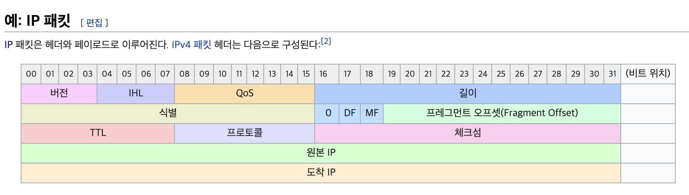
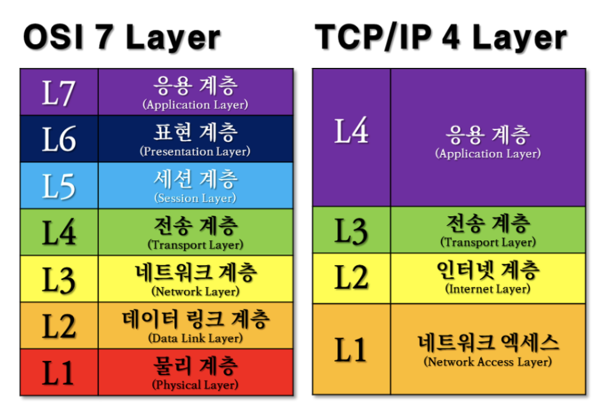
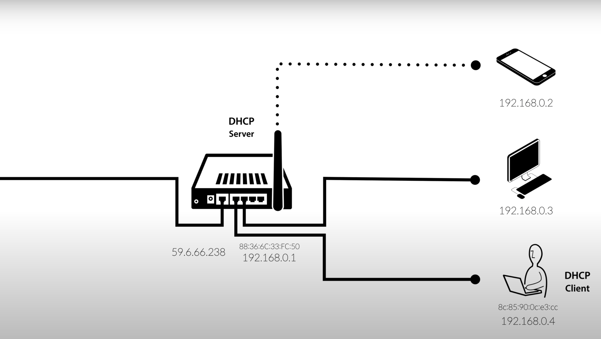
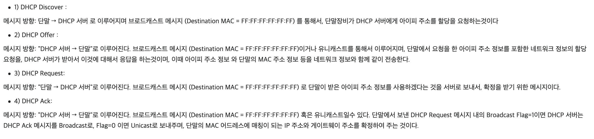
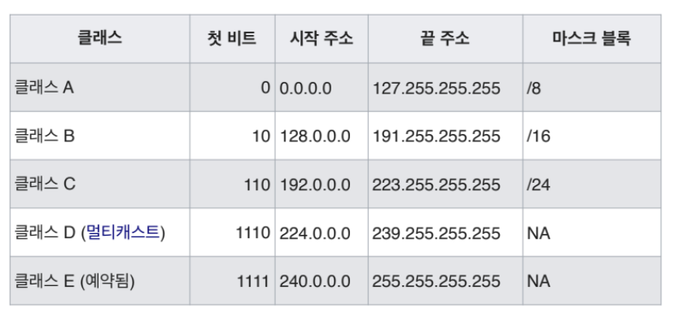

# 200525 TCP/IP

Tags: Network

# 용어

## Protocol

- 서로 다른 기기/사용자 간 정보를 주고받을 때, 그 정보의 형식, 순서, 에러 검출 방법 등을 결정하는 규칙
    
    ex) HTTP, FTP, **TCP**
    
- 통신규약

## Hosts

- 통신장비
    
    ex) 공유기에 연결된 내 노트북, 핸드폰, 데스크탑 모두 다 Hosts, 공유기도 Hosts
    

## Packet

- 통신할 때 주고 받는 소포(?) 같은 것

# TCP/IP

- Transmission Control Protocol/Internet Protocol
- 가장 널리 쓰이는 프로토콜
- 4계층으로 이루어짐

### Encapsulation

- 캡슐화 - 각 단계에서 담아야 할 새로운 정보들을 기존 패킷에 추가하고(감싸고) 하위 계층으로 넘겨줌
- Decapsulation - 각 단계에서 필요한 정보만 추출하고 패킷에서 해당 정보를 삭제한 다음(벗기고) 상위 계층으로 넘겨줌
- 각 계층은 다른 계층에서 일어나는 일을 신경쓰지 않아도 되므로 개발에 필요한 로드 감소

### Application Layer

- 웹 브라우저 - 서버 HTTP
- 파일 전송 FTP
- 메일 수신/발신 SMTP, IMAP, POP
- 도메인 주소 해석 DNS
- 암호화된 원격 Shell 접속 SSH

### Transfer Layer

- 두 호스트 간의 통신 방식을 정의
- TCP/UDP가 여기에 속함
- TCP : initialization이 필요하나 신뢰성 있는 전송
- UDP : 간단하지만 패킷 손상/손실 가능성
- TCP와 UDP의 포트는 프로세스에 할당됨

### Internet Layer

- 패킷을 어떻게 보낼 것인지 결정
- IPv4, IPv6
- 라우터는 IP를 기반으로 패킷을 라우팅한다

### Network Access Layer

- 네트워크 상의 기기들을 위한 규약
- Ethernet
- MAC 주소를 할당

# 로컬 네트워크에서 일어나는 일

### 공유기(Router)

- 우리 집에 인터넷에 연결하고 싶은 Hosts가 3개가 있음
- 하나의 Public IP를 할당받아 인터넷과 연결
- 내부의 Hosts들이 인터넷과 연결할 수 있도록 도와주는 놈!

### 59.6.66.238(Public IP)

- WAN(Wide Area Network)과 이어짐

## 새로운 Host가 공유기와 연결하는 과정

- 모든 통신장비 고유의 번호인 MAC 주소로 소통!
- 그리고 이에 관련된 가장 널리 쓰이는 규약이 DHCP(Dynamic Host Configuration Protocol)

이 때, 공유기는 Hosts 하나에 고정된 IP를 할당할수도

→ Dynamic IP address

매번 그때그때 새로운 IP를 할당할수도 있다

→ Static IP address

## Hosts가 Client로써 인터넷과 소통하는 과정

private IP와 public IP를 전환해주는 과정이 NAT(network address translation)

1. Hosts가 공유기에 192.168.0.4:80를 통해 요청을 보냄
2. 공유기가 Public IP를 통해 Server로 요청을 대신 보냄
3. Server는 Public IP인 59.6.66.238:80으로 응답함
4. 공유기는 이를 192.168.0.4:80으로 전환하여 Hosts에게 응답함

## Hosts가 Server가 되려면?

- 외부에서는 공유기의 public IP만 알고 있으므로, 특정 Hosts를 찾아갈수가 없다!
- 공유기 차원에서 하나의 포트를 정해서 "이 포트로 들어오는 요청들은 이 Hosts의 이 포트로 연결해주면 되겠다!" 가 필요함

→ 포트포워딩!

# IPv4

- IPv4 : IP주소를 32비트로 나타냄 → 약 42억개
- IPv6 : IP주소를 128비트로 나타냄 → 지구상의 모래알보다 많다

### IP 클래스

- IP의 앞부분은 네트워크 영역(서브넷, 지역), 뒷부분은 호스트 주소(상세 주소)를 가리킨다!
    
    ex) 카이스트의 네트워크는 143.248.35.xx 다!
    
- 네트워크 영역에 몇 비트를 할당할지가 클래스!

- 클래스 C는 네트워크 하나에 ip를 254개 밖에 못받고...클래스 B는 충분하긴 하지만 16000개만 받으면 동남

### CIDR(Classless Inter-Domain Routing)

- 네트워크 영역으로 사용될 비트의 수를 명시
- 143.248.35.11/24

→ 143.248.35.11 = 01001111 11110100 00100011 00001011

→ 255.255.255.0 = 11111111 11111111 11111111 00000000 ← **서브넷 마스크!**

⇒ 앞에 24비트가 네트워크 영역이라는 뜻!