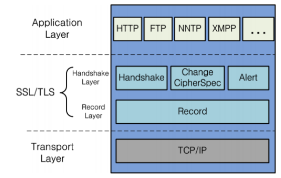
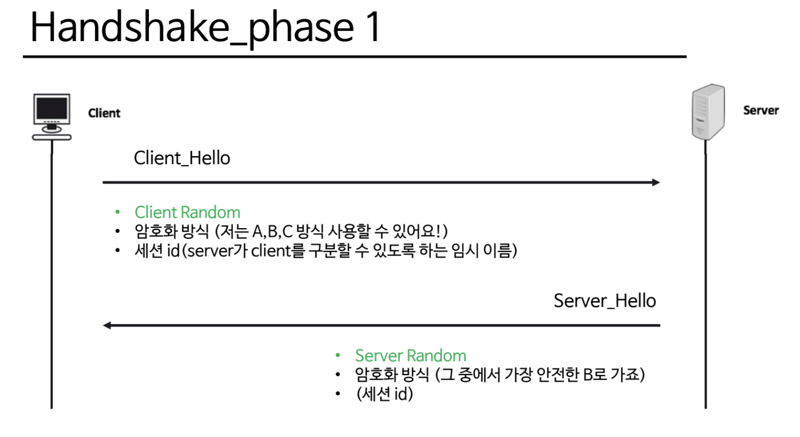
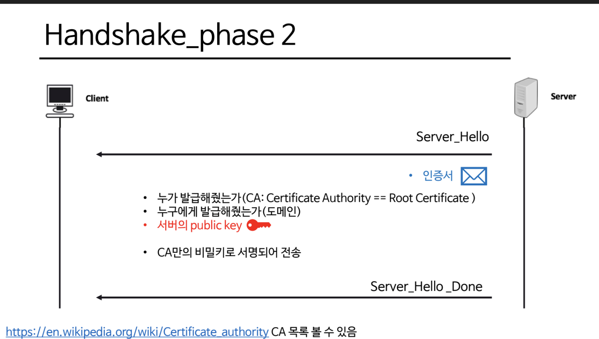
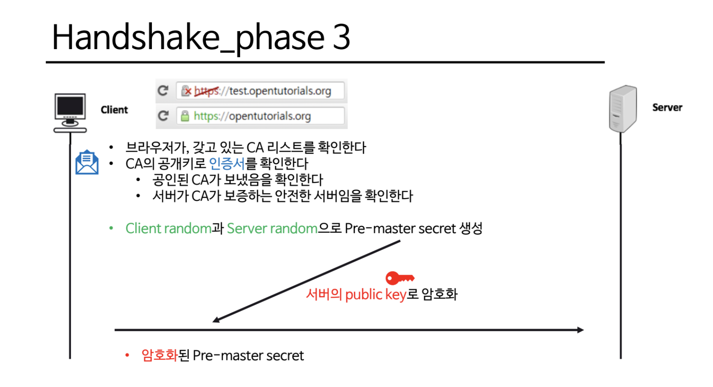
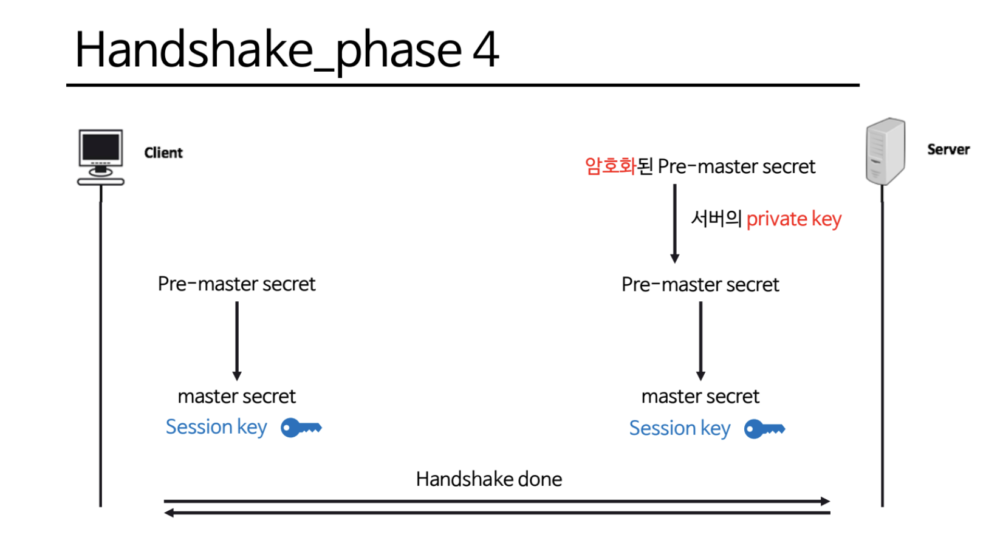

# 200525 TLS/SSL

Tags: Network

# 암호화

## 대칭키 암호

- 암호화키와 복호화키가 동일

## 공개키 암호(비대칭키 암호)

- 암호화키와 복호화키가 따로 있음
- 외부에 공개되는 키가 암호화/복호화 용인지에 따라

### 공개 키 암호

- 공개키로 암호화, 비밀키로 복호화
- 비밀키를 갖고있는 사용자만 해독 가능

→ 아무나 우체통에 편지를 넣을 수 있지만, 꺼내는 사람은 키를 가진 사람 한 명 뿐!

### 공개 키 서명

- 비밀키로 암호화, 공개키로 복호화
- 비밀키를 갖고있는 사용자만 암호화 가능

→ 인장으로 편지봉투를 봉하면 누구나 열어볼수 있지만, 발신자가 무조건 본인임을 증명 가능

## 참고) 해시

- 데이터를 특정길이의 다른 데이터로 전환하는 것!
- 복호화할 수 없으므로 엄밀하게 암호화는 아니다

# TLS/SSL

- TCP/IP 계층에서 Application Layer에 속함
- TLS 1.0 == SSL 3.0, 같은 말이라는 뜻

> 악수(HandShake) ⇒ 전송(Session) ⇒ 통신종료
> 

이중 HandShake가 너무너무너무너무 중요함

## SSL Handshake

- 데이터 전송(Session) 때 사용할 대칭 키를 서로 안전하게 확보하는 것이 목표!

사진출처) 내가 만듦

⇒ 복잡한 과정이지만 아무튼 요지

서로간의 대칭키를 안전하게 확보하면서 공개키 암호와 대칭키 암호의 각각의 장점만을 취함

SSL이 이렇게 튼튼하다!