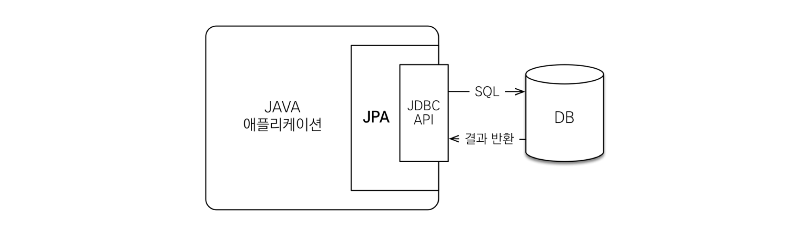
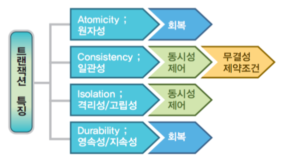
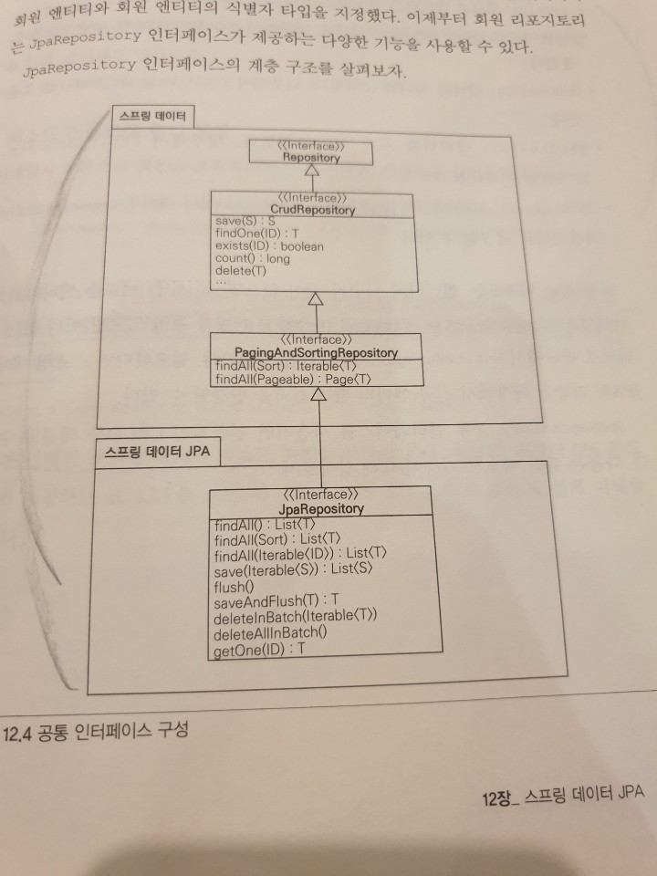

# 200524 JPA

Tags: Java, Server

# Layered Architecture

1. Presentation layer : View
2. Control layer: Controller
3. Business layer: Service
4. Persistence layer: DAO(Data Access Object, Repository) ← 데이터에 영속성을 부여해줌
5. Domain Model layer: VO(Value Object), DTO(Data Transfer Object)

## DTO

- 로직을 갖지 않는 순수한 데이터 객체
- 속성과 getter, setter만으로 이루어진 클래스!
- VO는 DTO와 거의 비슷하나 read only 속성을 가짐
- DTO는 전송되는 데이터의 컨테이너, VO는 데이터 그 자체(객체)의 의미로 사용됨

## DAO

- DB로의 접근을 전담하는 객체

---

# Persistence(영속성)

- Entity를 영구적으로 저장해주는 환경
- 프로그램을 종료해도 데이터를 잃지 않도록, DB에 데이터를 저장하는 것 == 영속성을 부여하는 것
- Persistence Framework는 SQL Mapper와 ORM으로 구분

## ORM(Object-relational mapping)

- 객체와 테이블의 매핑
- 객체의 메소드 호출만으로 쿼리를 수행할 수 있음
    - ex) SELECT * FROM user == user.findAll()
- 이 둘을 mapping하는 것은 ORM framework
- Persistant API라고도 부름
- ex) JPA, Hibernate

cf) **SQL Mapper** 

→ ORM이 객체 - 데이터의 매핑이라면, SQL Mapper는 객체 - SQL 쿼리의 매핑

→ ex) Mybatis, JdbcTempletes

# JPA(Java Persistence API)

[Copy of JPA YouTube 강의](https://www.notion.so/Copy-of-JPA-YouTube-aaf597bc74474145904450f94a2f7623)

- ORM을 사용하기 위한 표준 인터페이스 모음
    - 이 때, JPA를 구현하는 Implementation들을 ORM Framework라 부른다
    - ex) Hibernate, EclipseLink, DataNucleus, OpenJPA
- 세가지 구성요소
    1. javax.persistence.* 패키지로 정의된 API 그 자체
    2. JPAL(Java Persistence Query Language)
    3. 객체/관계 메타데이터

## JDBC(Java Database Connectivity)

- DB에 접근할 수 있도록 Java에서 제공하는 API
- 모든 Persistence Framework가 내부적으로 사용하고 있다
- DB에서 자료를 쿼리, 업데이트하는 방법 제공

## Hibernate

- JPA의 구현체 중 하나
- JDBC API가 내부에서 동작하고 있지만, 개발자가 직접 SQL을 작성할 필요는 없음

## JPA의 동작과정

- JPA는 애플리케이션과 JDBC(Java DB connectivity)사이에서 동작한다
    
    → 개발자가 직접 JDBC를 쓰는 것은 아님
    

## JPA를 사용하는 이유

1. SQL 중심적 개발 대신 객체 중심으로 개발 가능
2. Java Collection에 데이터를 넣었다 뺐다 하듯이 사용 가능(간단한 CRUD)
3. 유지보수가 편리하다
    
    →필드가 바뀌어도 모든 SQL을 수정할 필요가 없다
    
4. Object와 RDB들 간의 패러다임의 불일치들을 해결해준다

[[JPA] JPA란 - Heee's Development Blog](https://gmlwjd9405.github.io/2019/08/04/what-is-jpa.html)

[[JDBC] JDBC, JPA/Hibernate, Mybatis의 차이 - Heee's Development Blog](https://gmlwjd9405.github.io/2018/12/25/difference-jdbc-jpa-mybatis.html)

# 트랜잭션(Transaction)

:DB의 상태를 변환시키는 작업 단위

## ACID(트랜잭션의 특징)

[[DB이론] 트랜잭션(transaction)과 ACID 특성을 보장하는 방법](https://victorydntmd.tistory.com/129)

[[Database] 8. 트랜잭션, 동시성 제어, 회복](https://mangkyu.tistory.com/30)

- Atomicity(원자성)
    - 트랜잭션의 연산은 DB에 모두 반영되거나, 모두 반영되지 않아야 한다
    - 하나의 연산이라도 오류가 발생하면 트랜잭션 전체가 취소되어야 한다
    - Transaction은 Commit되거나 Rollback된다
- Consistency(일관성)
    - 트랜잭션이 DB의 고정요소들을 변화시키지 않는 것/ 제약조건을 위배하지 않는 것
    - ex) 트랜잭션이 계좌 엔티티의 잔고 필드를 integer에서 string으로 바꾸면 안된다
    - ex) 트랜잭션 수행 후
- Isolation(격리성)
    - 트랜잭션 수행시 다른 트랜잭션의 작업이 끼어들어서는 안된다
- Durability(지속성)
    - 성공적으로 수행된 트랜잭션은 영원히 반영된다
    
    
    

### 원자성/지속성 보장

- 회복 관리자 프로그램을 이용
- 롤백 세그멘트(rollback segment)에 트랜잭션 수행 직전의 상태를 보관
- 오류가 발생해도 롤백이 가능하다
- 일부만 진행된 트랜잭션을 취소시킨다(원자성)
- 값을 트랜잭션 이전의 상태로 복원한다 지속성

### 일관성/격리성 보장

- 동시성 제어로 해결해야 한다
- + 무결성 제약 조건을 통해 일관성을 보장한다
- 

