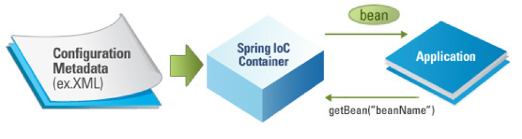
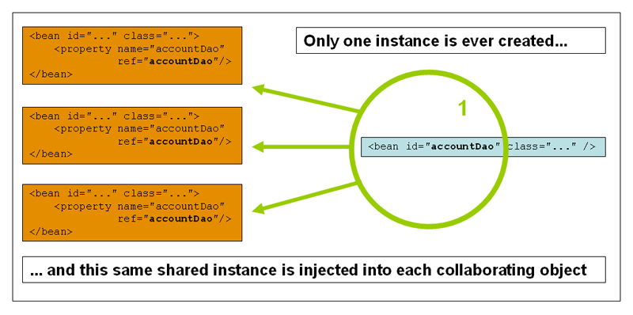
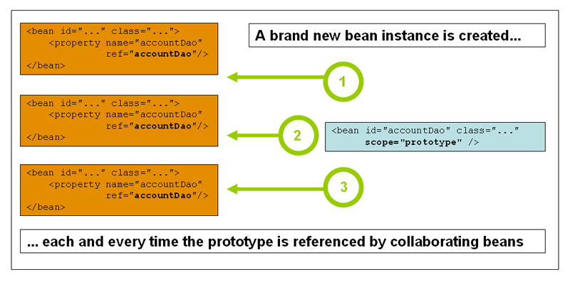
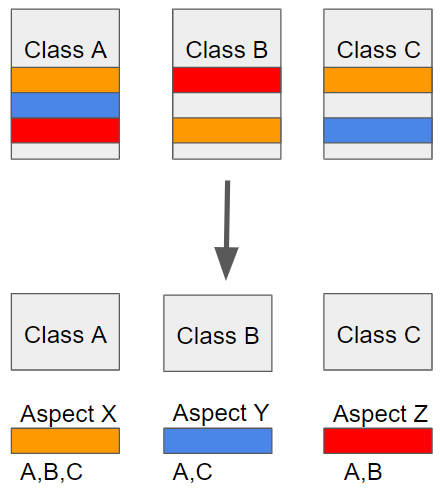
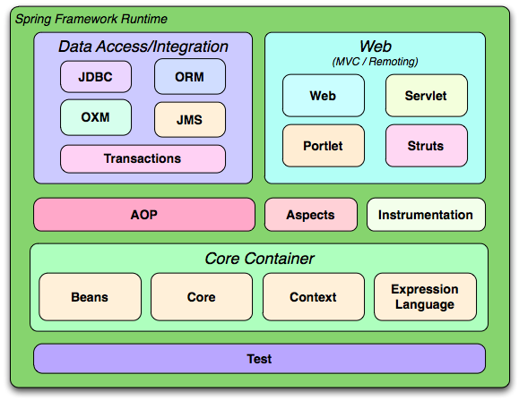
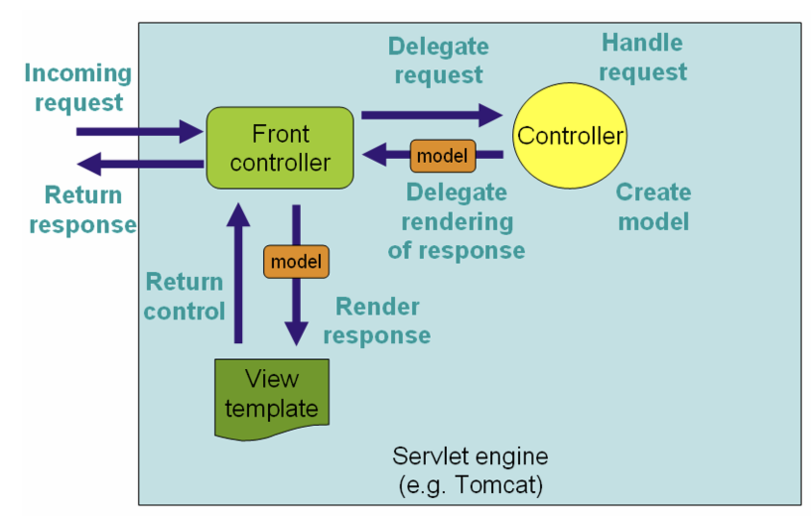
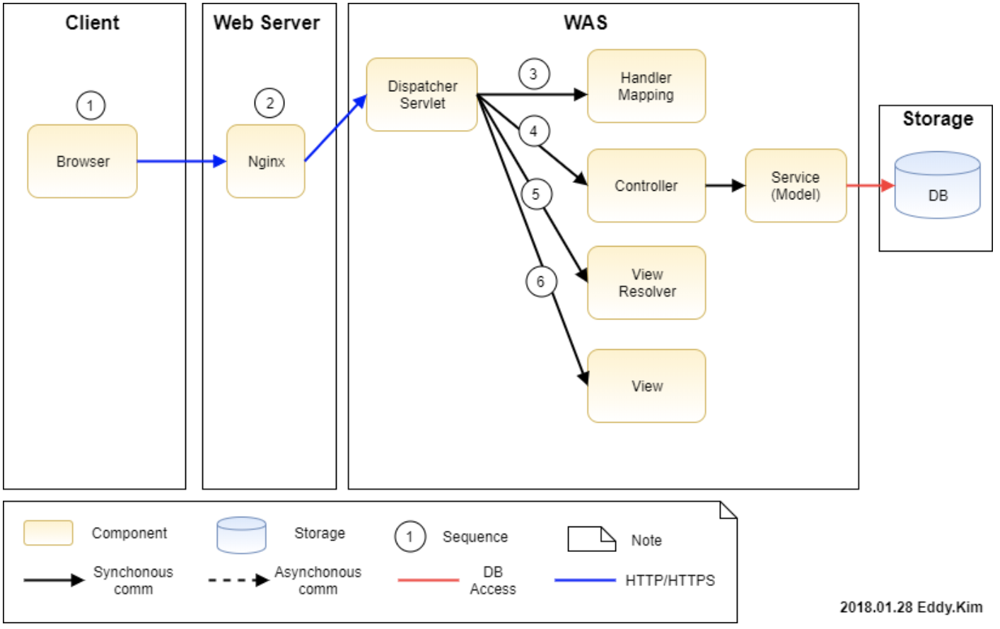
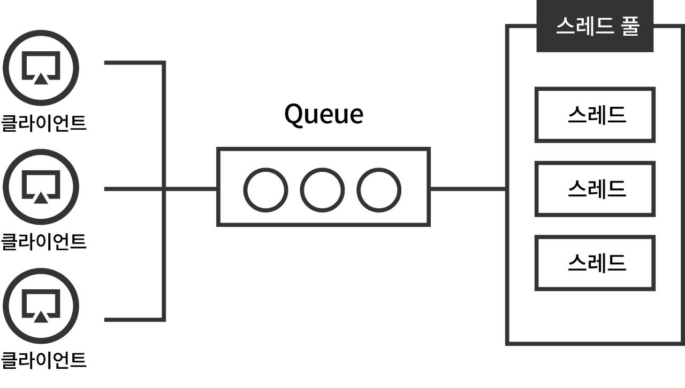
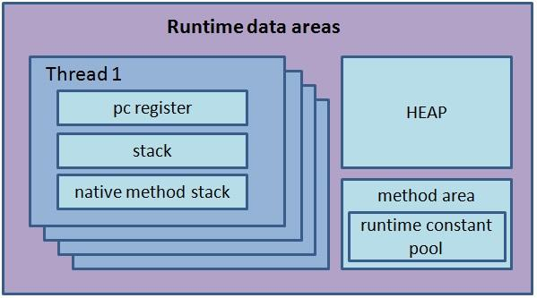

# 200524 Spring Framework

Tags: Java, Server

:Java EE 개발을 위한 오픈소스 애플리케이션 프레임워크

[cheese10yun/spring-guide](https://github.com/cheese10yun/spring-guide)

# 특징

1. 경량 컨테이너로 자바 객체를 직접 관리
2. POJO 방식의 프레임워크
3. IoC Container
4. DI 지원
5. AOP
6. 영속성과 관련된 다양한 서비스 지원
7. 높은 확장성

## POJO(Plain Old Java Object)

[[java] POJO란?](https://m.blog.naver.com/writer0713/220700687650)

:말 그대로 오래된 방식의 간단한 자바 객체를 의미한다

- 개발자의 노고를 덜기 위해 EJB라는 개념이 널리 사용되었음
- 그런데 EJB의 1만큼을 사용하기 위해 99의 짐을 추가로 지고 가야하는/ 배보다 배꼽이 더 큰 상황 발생
- POJO 기반의 프레임워크를 사용하자!

현재의 POJO 프로그래밍의 의미 : 객체지향적인 설계원칙을 잘 따르며, 의존성이 적고, 테스트가 용이한 코드

## Spring Bean

:Spring이 다루는 POJO

Spring IoC Container에 의해 인스턴스화, 관리, 생성된다

- 기본적으로 Spring은 모든 bean을 singleton으로 생성하여 관리한다!
    
    
    
    - Singleton: 하나의 bean 정의에 대해, 하나의 객체만 존재한다
    
    
    
    - Prototype: 하나의 bean 정의에 대해, 다수의 객체가 존재한다

## 제어의 역전(IoC, Inversion of Control)

: 프로그래머가 작성한 코드가 외부 라이브러리의 코드를 호출하는 경우가 아니라, 외부 라이브러리(프레임워크)의 코드가 프로그래머의 코드를 호출하는 것

- 프레임워크가 전체 프로그램의 흐름을 결정하게 하자!
- 어떻게 하면 프레임워크가 내 코드를 호출하게 할 수 있을까?
    - 프레임워크의 interface, abstract를 구현한 후 프레임 워크에 넘겨준다
    - == 객체를 프레임워크에 주입한다(DI)

## 의존성 주입(DI, Dependency Injection)

:의존성+주입+의존성 분리

[[DI] Dependency Injection 이란?](https://medium.com/@jang.wangsu/di-dependency-injection-%EC%9D%B4%EB%9E%80-1b12fdefec4f)

- 의존성: A클래스 내부에서 B클래스 변수로 사용한다? → A클래스는 B클래스에 의존한다
- 주입: 외부에서 객체를 생성해서 넣어주는 것
    - 생성자 주입
    - Setter 주입
    - 인터페이스 주입
- 의존성 분리: SOLID의 'D'에 의거, interface를 이용하여 상위 계층이 하위 계층에 의존하는 상황에서 하위 계층의 구현으로 부터 독립됨
    - 제어의 주체를 interface가 갖게된다 ⇒ IoC

의존성 주입의 의의

- 의존관계의 설정이 컴파일 단계가 아닌 실행 단계에서 이루어져 모듈들 간의 결합도를 낮춤
- 코드 재사용성을 높임
- Mock 등을 이용한 Unit Testing의 편의성을 높여줌

## 관점지향 프로그래밍(AOP, Aspect-Oriented Programming)

[AOP 정리 (3)](https://jojoldu.tistory.com/71)

- ClassA, B, C들에 반복 사용되는 흩어진 관심사(Crosscutting Concerns)
    
    [cross-cutting concern](https://www.notion.so/cross-cutting-concern-dc633923985044829ba5eac8f837b611)
    
- 흩어진 관심사를 관점(Aspect)로 모듈화하여, 비즈니스 로직 내에서 재사용하자!
- OOP는 상속, 위임으로 공통된 기능을 재사용하지만, 전체 애플리케이션 여기저기서 사용되는 부가기능들을 처리하는 데에는 한계가 있다

[Copy of Annotation](https://www.notion.so/Copy-of-Annotation-beade0b2883947589fb939eb46c74310)

# Spring 모듈

: Spring Framework는 20여개의 모듈로 구성된다

⇒ 경량성을 강조하던 프레임워크였으나 점차 무거워지기 시작

⇒ 필요한 라이브러리만 추가하면 되나, 어떤 라이브러리를 추가해야 할지 알기 어렵다...!!

⇒ Spring-Boot 탄생

# Spring Boot

1. 자주 사용하는 Spring 하위 모듈을 미리 모아놓음
    
    ex) spring-boot-starter-web을 Gradle 설정만 해주면 관련 라이브러리를 받아옴
    
2. 필요한 설정을 자동으로 수행함
    
    ex) @SpringBootApplication = @Configuration + @EnableAutoConfiguration + @ComponentScan
    
3. Tomcat 내장서버를 포함하고 있다

# SpringMVC

## MVC pattern, Front-Controller pattern

- Model: 실질적인 비즈니스 로직 동작, 뷰 템플릿에 렌더링할 데이터 관리
- View: 사용자에게 보여줄 화면 관리
- Controller: Model과 View 사이의 상호작용 제어
    - Front-Controller: 수많은 요청들이 여러 컨트롤러로 분산되기 이전, 모든 요청을 받아 제어하는 가장 앞에 서 있는 컨트롤러 ⇒ 이것을 이용하는 패턴이 Front-Controller Pattern
    

## SpringMVC

1. 사용자는 인터넷 브라우저를 통해서 웹사이트에 접속한다.
2. 웹서버(Nginx)는 WAS(Tomcat, servlet container)에 Reverse Proxy 처리를 수행하고, DispatcherServlet에서는 요청을 받는다. ⇒ FrontController의 역할!
3. HandlerMapping의 도움을 받아 어떤 Controller에 위임을 할지 결정한다
4. HandlerMapping의 도움으로 선택된 Controller에 요청을 보낸다. Controller는 적절한 응답을 모델을 통해 반환한다.
5. ViewResolver의 도움을 받아, View이름에 매핑된 View를 반환한다.
6. View는 화면을 템플릿 작업을 통해 반환하고, DispatcherServlet에 의해 사용자에게 반환된다.

## SpringMVC의 한계와 Spring WebFlux

[Spring WebFlux는 어떻게 적은 리소스로 많은 트래픽을 감당할까?](https://alwayspr.tistory.com/44)

- Tomcat의 default thread size는 200에 불과하다
- 200개가 넘는 요청이 동시에 들어오면 남는 요청은 queue에서 대기해야 한다

- 여기 겹쳐있는 스레드 들이 스레드 풀
    - 스레드를 만들거나 지우는 일은 cost가 많이 드는 일이다
    - 스레드도 결국 객체, 빈 객체를 잔뜩 만들어두고 필요한 요청에 맞게 실행할 메소드, 전달받은 파라미터들을 스레드 메모리 공간에 담는 것이 스레드를 할당하는 것이다
- 스레드들은 힙에 있는 Controller Singleton에 제각각 요청을 날린다
- 사실 request들을 처리하는 일에서 가장 많은 시간을 잡아먹는 일은 '기다리기'이다
- 스레드가 Singleton에 요청을 날리고, 적절한 대답을 받기까지 기다리는 동안 요청들은 큐에서 대기중인 것이다!

→ 사실 이런 스레드풀의 개념은 앞단(클라이언트 → 서버) 간의 통신 뿐만 아니라, 뒷단(서버→DB)에도 있다 그것이 DB connection pool(DBCP)

- Spring WebFlux는 Event Loop를 통해 다수의 요청을 처리한다
- worker thread default size는 서버의 core 개수와 같음
- core가 4개라면 thread도 4개뿐
- 그럼에도 불구하고 더 많은 request를 효율적으로 처리할 수 있다

- Spring MVC와 Spring Web Flux의 효율성 차이는 위에서 말한 '기다리기'를 줄이는 것이 핵심
- Event Loop에는 수많은 '일감'들이 돌고있다
- Worker thread는 이 '일감'들을 메인 로직에 던져주고 알아서 처리된 일감들을 Event Loop로 다시 넣게끔 하거나, 처리된 일감을 응답으로 외부에 송출하는 등의 일을 한다
- 이 Event Loop는 돌고있는 일감의 개수와 관계없이 계에에에속 돌고 있다 → size가 0인 루프다